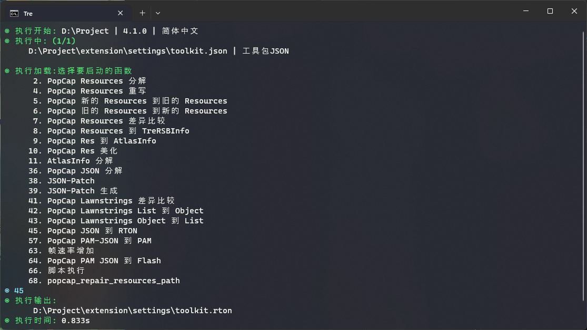

# About

`Tre` is a PvZ2-Modding tool. Its purpose is to simplify tasks and reduce difficulties for entry modders.

## Documentation List

- [Installation](./documentation/installation.md)
- [Functions](./documentation/functions.md)
- [Usage](./documentation/usage.md)
- [Tips & Tricks](./documentation/tips.md)

## Platform Support

Mainly Support: Windows 10+

For other platforms such as `Macintosh` or `Linux`, you can download the source code from GitHub and rebuild it yourself. Here are the commands you need to do to clone this project:

```
$ git clone https://github.com/Haruma-VN/Tre.git
$ cd ./Tre/tool/
$ . code
```

Please note that you need to have these tools before you can build the project:

- [NodeJS `18.16.0+`](https://nodejs.org/en)
- [TypeScript `4.8+`](https://www.typescriptlang.org/)
- [Python `3.9+`](https://www.python.org/)
- [.NET `6.0+`](https://dotnet.microsoft.com/en-us/download/dotnet/6.0)
- [Powershell](https://learn.microsoft.com/en-us/powershell/)

## Preview

- **Installer help updating the tool**

  
  
  

- **Support English, Chinese & Vietnamese**

  
  
  

- **Process multiple PopCap PvZ2 Files**

  
  
  
  
  
  
