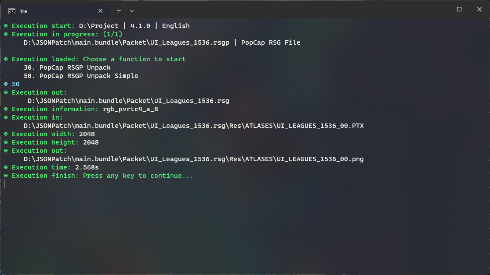
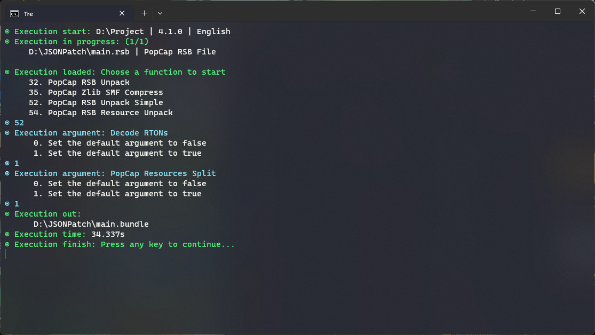
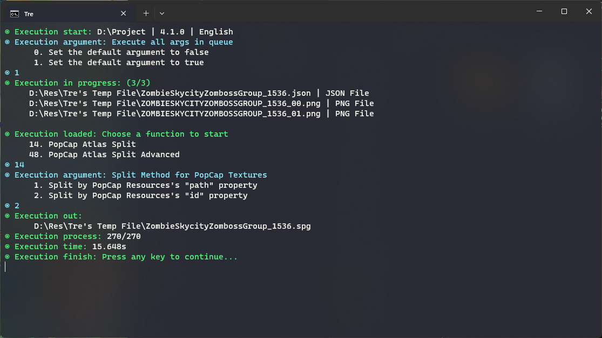
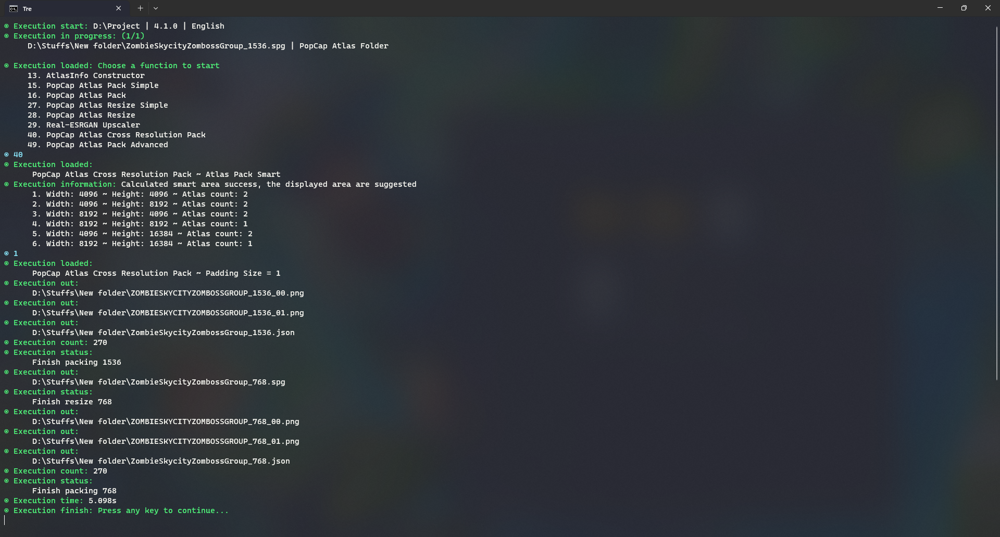
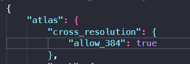

# Tips & Tricks

`Tre` contains various of functions. However, while coding and experiencing the tool, I find some useful things that might help you reduce some time.

- [PopCap RSG Unpack (Simple)](#PopCap-RSG-Unpack-Simple)
- [PopCap RSB Unpack (Simple)](#PopCap-RSB-Unpack-Simple)
- [PopCap Atlas Split (Normal & Advanced)](#PopCap-Atlas-Split)
- [PopCap Atlas Cross Resolution Pack](#PopCap-Atlas-Cross-Resolution-Pack)

## PopCap RSG Unpack (Simple)

If you are still using the traditional way of `RSG`, `PGSR` or `RSGP` unpacking, you might consider to use the `Simple` function of Tre as it takes less time to do things for you. Example: If you want to `Decode PTX` after unpack `RSG`, you should use the `PopCap RSGP Unpack Simple` as it `Unpack` & `Decode` for you instantly.

## PopCap RSB Unpack (Simple)

If you are still using the traditional way of `RSB` unpacking, you can consider using `PopCap RSB Unpack Simple` as it can `Decode RTONS` & `Split PopCap Resources` directly. This function was adapted from `SPCUtil` with some implementations as it work for `Vanilla 10.4+` while `SPCUtil` won’t work.

## PopCap Atlas Split (Normal & Advanced)

This tool contains both way for splitting `Atlas` to `Sprites`. However, it is recommended to use `Normal` (PopCap Atlas Split) as it simpler. While `Advanced` only good if you taking `Multiple Sprites` from a `Subgroup` to `Another Subgroup`. Keep in mind that you won’t be using it much as it takes doubled the time compared to `Normal` one which only requires you to edit `AtlasInfo.json`.

When the tool said `is duplicated` while splitting by property `path`, you should consider change to `id` to prevent bugs. It is recommended to use `path` with `Vanilla International version`, but not `Chinese versions` as they duplicated `path` a lot.

## PopCap Atlas Cross Resolution Pack

This is a good feature of the tool appeared since version `3.0.0 beta`, it is really recommended to use this function as it reduce a lot of time. You need to prepare `_1536.rsg` represent for `1536` version of the `atlas` you want. The next, you use `Tre` to process that folder with `PopCap Atlas Cross Resolution Pack`, from the `1536` build it generates you `768` and perhaps `384` (deprecated since 10.4.1).

If you want to `Pack 384`, you can go to `~{home}/extension/settings/toolkit.json` and set the property `allow_384` to `true`. The default behavior is `false` and will not change.

## JSON Util

This tool has a custom JSON Parsing system which does not follow the JSON Standard as it supports trailing commas JSON.
However, you can customize the tool JSON output by go to `~{home}/extension/settings/toolkit.json` and set the `property`.
Example, if you want to have trailing commas json, you need to edit `allow_trailing_commas` to `true`, the default behavior is `false` and will not change.

**Happy Modding!**
